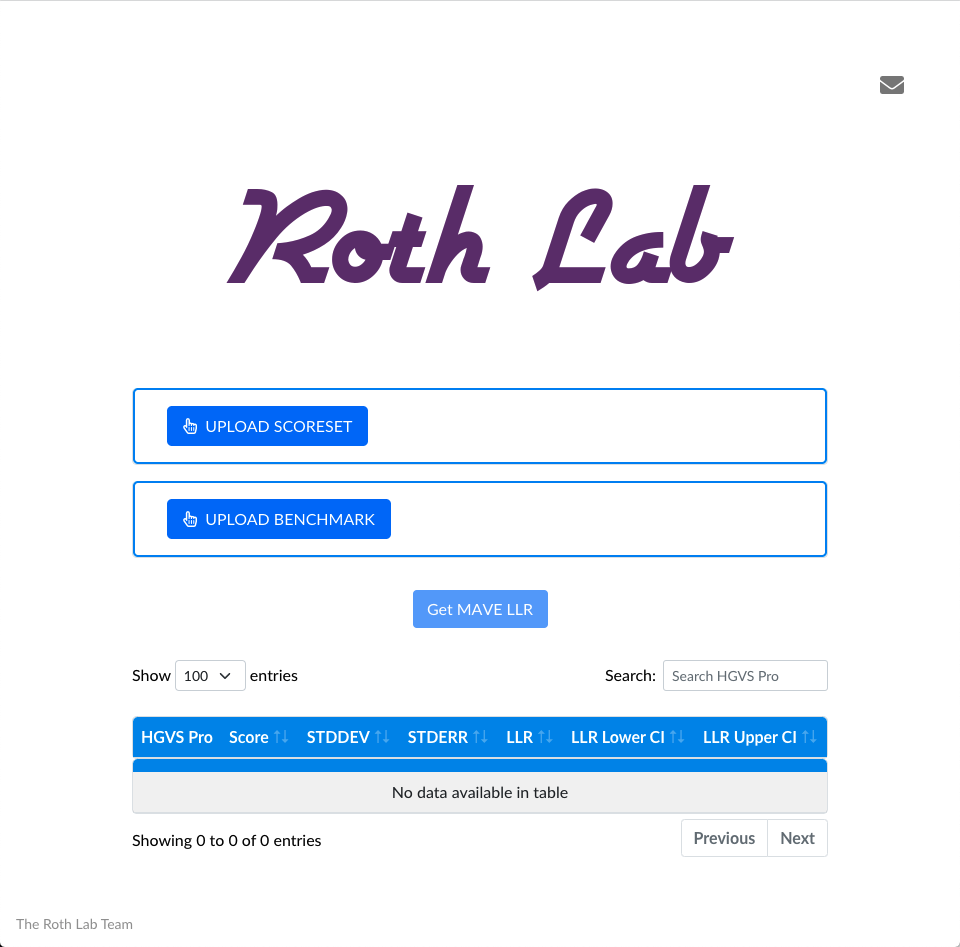

# LLRWS

Log Linear Regression (LLR) Web Service. LLRWS is a web service to generate an LLR dataset from a MAVE scoreset and variant reference file (both CSV).

    

## Background

It is often a valuable tool is developed in research without an interface for the common user. This web application attempts to provide a facile interface to such  tool.

MAVE LLR is an algorithm that provides functional variant scores for a variant observed in the clinic. This evaluation provides a rapid estimate on its health effects on the patient.

The algorithm requires a functional score for each variant and a reference data set unto which the score is calibrated.

## Installation and configuration

Python>=3.6 is required. Install application requirements using pip:

`$ pip install -r requirements.txt`

Start up the flask web application:

`$ python run.py`

Navigate to `http://localhost:5000` on your favorite browser.

## Navigation

Navigation

## Current release

Current release

## Contribute

- [Issues Tracker](https://github.com/irahorecka/llrws/issues)
- [Source Code](https://github.com/irahorecka/llrws/tree/master/llrws)

## Support

If you are having issues or would like to propose a new feature, please use the [issues tracker](https://github.com/irahorecka/llrws/issues).

## License

The project is licensed under the MIT license.
